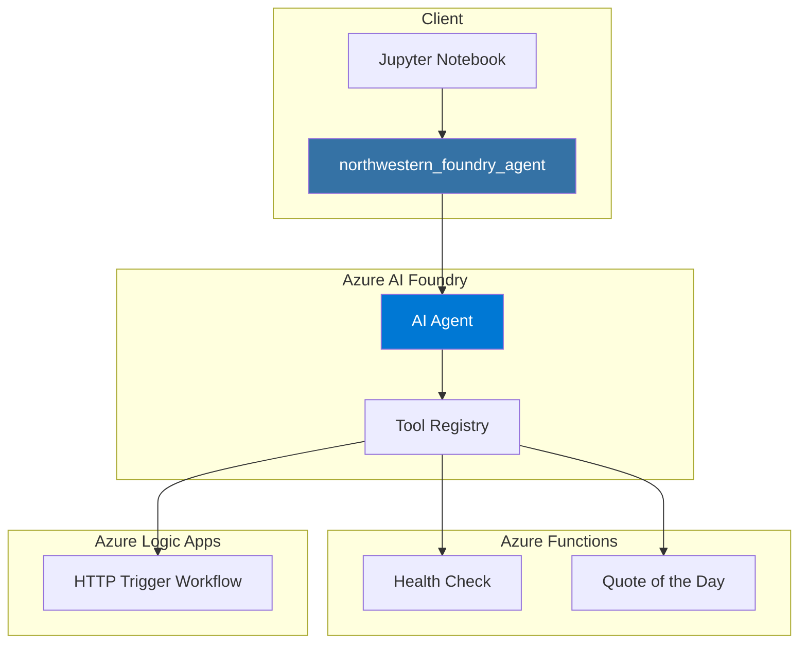

# Northwestern MSAI Foundry Agent Extension

[](https://github.com/pablosalvador10/northwestern-msai-foundry-agent-extension/actions/workflows/ci.yml)
[](https://www.python.org/downloads/)
[](LICENSE)

Build and extend an Azure AI Foundry agent by connecting it to real Azure tools (Azure Functions and Logic Apps). This educational repository is designed for Northwestern MSAI students to learn enterprise AI integration patterns.

## What You'll Build

In this lab series, you will:

1. **Create an AI Agent** - Build an Azure AI Foundry agent with custom instructions
2. **Add Function Tools** - Integrate Azure Functions as callable tools
3. **Add Logic App Tools** - Connect Logic App workflows for complex operations
4. **Run the Agent** - See the agent intelligently select and use tools

## Architecture



### Why This Architecture?

| Component | Purpose | Benefits |
|-----------|---------|----------|
| **Azure AI Foundry** | AI orchestration | Managed infrastructure, built-in tool calling |
| **Azure Functions** | Stateless operations | Serverless, fast, cost-effective |
| **Logic Apps** | Complex workflows | Visual designer, 400+ connectors |
| **Python Package** | SDK abstraction | Clean API, reusable code |

## Prerequisites

Before starting, ensure you have:

- [ ] **Azure Subscription** with permissions to create resources
- [ ] **Python 3.11+** installed
- [ ] **Git** installed
- [ ] **Azure CLI** installed (`az` command)
- [ ] **Azure Functions Core Tools** (optional, for local development)

## Quickstart

### 1. Clone and Setup

```bash
# Clone the repository
git clone https://github.com/pablosalvador10/northwestern-msai-foundry-agent-extension.git
cd northwestern-msai-foundry-agent-extension

# Create virtual environment
python -m venv .venv
source .venv/bin/activate  # Windows: .venv\Scripts\activate

# Install dependencies (including dev tools)
make install-dev
```

### 2. Configure Environment

```bash
# Copy example environment file
cp .env.example .env

# Edit .env with your Azure credentials
# Required:
#   AZURE_AI_PROJECT_CONNECTION_STRING - From Azure AI Foundry
#   AZURE_FUNCTION_APP_URL - Your deployed Functions URL
#   AZURE_FUNCTION_KEY - Function authentication key
```

See [docs/foundry_setup.md](docs/foundry_setup.md) for detailed setup instructions.

### 3. Run the Labs

Launch Jupyter and work through the notebooks in order:

```bash
jupyter notebook notebooks/
```

| Lab | Description |
|-----|-------------|
| [01_create_agent.ipynb](notebooks/01_create_agent.ipynb) | Create your first AI agent |
| [02_function_tool_1.ipynb](notebooks/02_function_tool_1.ipynb) | Add health check tool |
| [03_function_tool_2.ipynb](notebooks/03_function_tool_2.ipynb) | Add quote tool, multi-tool agent |
| [04_logic_app_integration.ipynb](notebooks/04_logic_app_integration.ipynb) | Integrate Logic Apps |

## Project Structure

```
├── src/northwestern_foundry_agent/   # Python package
│   ├── config/                       # Settings and environment
│   ├── foundry/                      # Agent creation and tools
│   ├── integrations/
│   │   ├── azure_functions/          # Functions client
│   │   └── logic_apps/               # Logic Apps client
│   └── utils/                        # Logging, errors, validation
├── notebooks/                        # Step-by-step labs
├── functions/                        # Azure Functions project
├── tests/                            # Unit tests
├── docs/                             # Documentation
├── infra/                            # Infrastructure templates
└── .github/workflows/                # CI/CD
```

## Deploy Azure Functions

### Local Development

```bash
cd functions
python -m venv .venv
source .venv/bin/activate
pip install -r requirements.txt

# Start local server
func start
```

### Deploy to Azure

```bash
# Create Function App (if not exists)
az functionapp create \
    --name your-function-app \
    --resource-group your-rg \
    --consumption-plan-location eastus \
    --runtime python \
    --runtime-version 3.11 \
    --functions-version 4

# Deploy
cd functions
func azure functionapp publish your-function-app
```

See [docs/functions_setup.md](docs/functions_setup.md) for complete instructions.

## Wire Endpoints into the Agent

After deploying, update your `.env`:

```bash
AZURE_FUNCTION_APP_URL="https://your-function-app.azurewebsites.net"
AZURE_FUNCTION_KEY="your-function-key"
LOGIC_APP_TRIGGER_URL="https://your-logic-app-url"
```

Then in your code:

```python
from northwestern_foundry_agent import FoundryAgent, Settings
from northwestern_foundry_agent.foundry.tools import create_health_check_tool
from northwestern_foundry_agent.integrations.azure_functions import (
    AzureFunctionsClient,
    create_function_handlers,
)

# Load settings
settings = Settings()

# Create agent
agent = FoundryAgent(settings)

# Create function client and handlers
client = AzureFunctionsClient(settings)
handlers = create_function_handlers(client)

# Register tools
health_tool = create_health_check_tool(f"{settings.azure_function_app_url}/api/health")
agent.register_tool(health_tool, handlers["health_check"])

# Create and run agent
agent.create_agent("my-agent", "You are a helpful assistant.")
response = agent.run("Check the system health")
```

## Development

### Commands

```bash
make install      # Install production dependencies
make install-dev  # Install development dependencies
make lint         # Run linting (ruff + mypy)
make format       # Format code (black + ruff)
make test         # Run tests
make test-cov     # Run tests with coverage
make clean        # Remove build artifacts
```

### Running Tests

```bash
# Run all tests
make test

# Run specific test file
pytest tests/test_azure_functions.py -v

# Run with coverage
make test-cov
```

## Troubleshooting

### Common Issues

| Issue | Solution |
|-------|----------|
| `ConfigurationError: connection string not configured` | Add `AZURE_AI_PROJECT_CONNECTION_STRING` to `.env` |
| `FunctionInvocationError: 401 Unauthorized` | Check `AZURE_FUNCTION_KEY` is correct |
| `Import error: azure.ai.projects` | Install: `pip install azure-ai-projects` |
| Tests fail with `httpx` errors | Install test deps: `pip install -e ".[dev]"` |

### Getting Help

1. Check the [documentation](docs/)
2. Review [troubleshooting guides](docs/foundry_setup.md#troubleshooting)
3. Open an issue with:
   - Error message
   - Steps to reproduce
   - Environment details

## Documentation

| Document | Description |
|----------|-------------|
| [architecture.md](docs/architecture.md) | System architecture and design decisions |
| [foundry_setup.md](docs/foundry_setup.md) | Azure AI Foundry setup guide |
| [functions_setup.md](docs/functions_setup.md) | Azure Functions deployment |
| [logic_apps_setup.md](docs/logic_apps_setup.md) | Logic Apps configuration |
| [copilot_workflow.md](docs/copilot_workflow.md) | Using GitHub Copilot effectively |

## Contributing

Contributions are welcome! Please read [CONTRIBUTING.md](CONTRIBUTING.md) for guidelines.

## Security

See [SECURITY.md](SECURITY.md) for security policies and reporting vulnerabilities.

## License

This project is licensed under the MIT License - see [LICENSE](LICENSE) for details.

---

**Northwestern University MSAI Program** | Built for educational purposes
