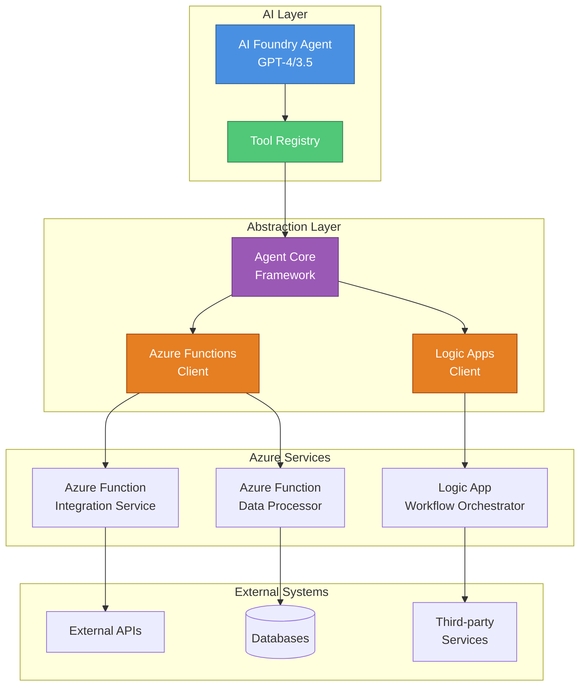
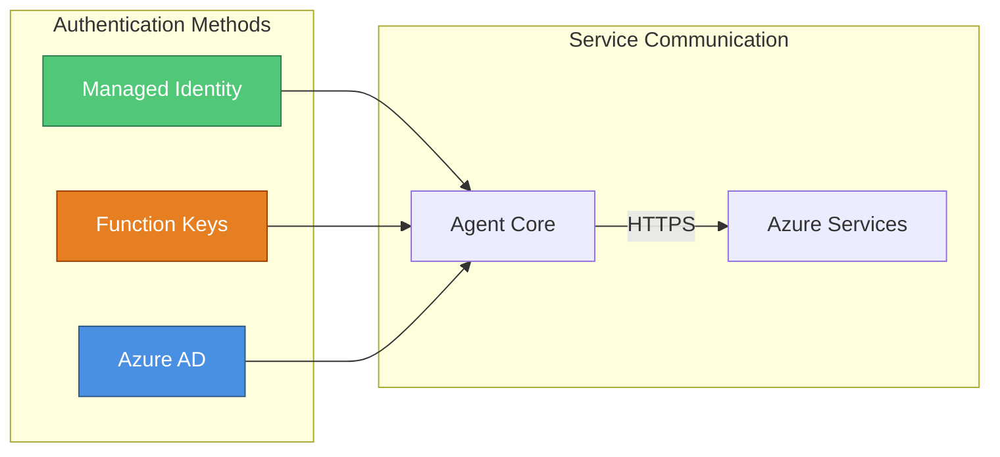

# Architecture Overview

## System Architecture

The Azure AI Foundry Agent Extension provides a modular architecture for integrating AI agents with Azure cloud services. The system enables intelligent agents to interact with Azure Functions and Logic Apps as tools, creating powerful automation workflows.

## Component Descriptions

### AI Layer
- **AI Foundry Agent**: The core AI agent powered by Azure OpenAI (GPT-4 or GPT-3.5-turbo)
- **Tool Registry**: Manages available tools and their configurations

### Abstraction Layer
- **Agent Core Framework**: Orchestrates agent behavior and tool invocation
- **Azure Functions Client**: Provides HTTP-based integration with Azure Functions
- **Logic Apps Client**: Enables workflow triggering and management

### Azure Services
- **Data Processor Function**: Handles data transformation and processing tasks
- **Integration Service Function**: Manages external service integrations
- **Workflow Orchestrator**: Logic App for complex, multi-step workflows

### External Systems
Integration points for databases, APIs, and third-party services

## Data Flow

1. **User Input** → AI Foundry Agent receives natural language requests
2. **Tool Selection** → Agent identifies appropriate Azure tools to use
3. **Tool Invocation** → Abstraction layer calls Azure Functions or Logic Apps
4. **Service Execution** → Azure services process requests and interact with external systems
5. **Response Aggregation** → Results flow back through the abstraction layer
6. **AI Response** → Agent synthesizes results into natural language response

## Security Architecture

### Security Features
- **Managed Identity**: Passwordless authentication for Azure-to-Azure communication
- **Function Keys**: Secure HTTP endpoint access
- **Azure AD Integration**: Enterprise-grade identity management
- **HTTPS Only**: All communications encrypted in transit
- **Secrets Management**: Environment variables and Azure Key Vault integration

## Scalability Considerations

- **Horizontal Scaling**: Azure Functions scale automatically based on demand
- **Async Operations**: Non-blocking I/O for high-concurrency scenarios
- **Connection Pooling**: Efficient resource utilization
- **Timeout Management**: Configurable timeouts prevent resource exhaustion

## Monitoring and Observability

- **Structured Logging**: Comprehensive logging at all layers
- **Azure Monitor Integration**: Built-in telemetry and diagnostics
- **Application Insights**: Performance monitoring and alerting
- **Log Levels**: Configurable verbosity (DEBUG, INFO, WARNING, ERROR)
