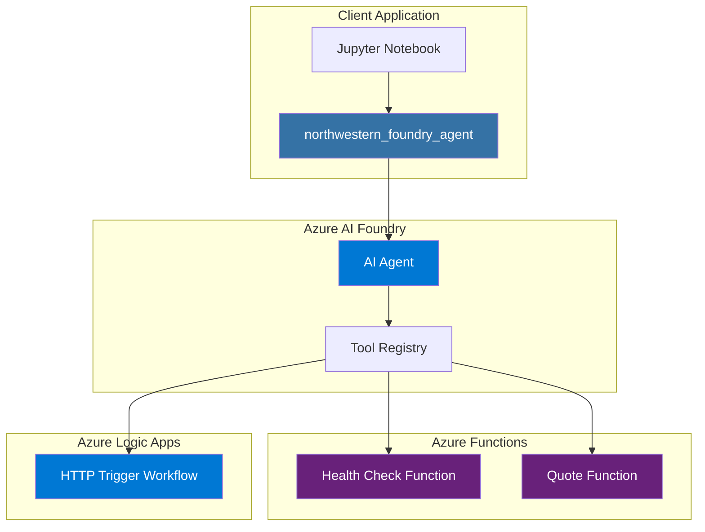
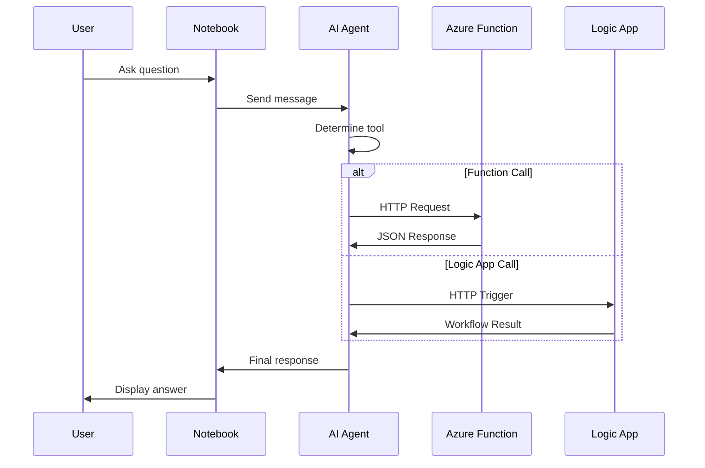

# Architecture Overview

This document describes the architecture of the Northwestern MSAI Foundry Agent Extension project.

## System Architecture

## Component Overview

### 1. Python Package (`northwestern_foundry_agent`)

The core Python package provides:

- **Config Module**: Environment-based configuration management
- **Foundry Module**: Azure AI Foundry agent creation and management
- **Integrations Module**: Clients for Azure Functions and Logic Apps
- **Utils Module**: Logging, retry logic, validation, and error handling

### 2. Azure AI Foundry Agent

The agent serves as the central orchestrator:

- Processes natural language queries
- Determines which tools to invoke
- Handles tool responses and generates final answers

### 3. Azure Functions

Two HTTP-triggered functions:

| Function | Purpose | Method |
|----------|---------|--------|
| `health_check` | Service health monitoring | GET |
| `quote_of_the_day` | Returns inspirational quotes | GET |

### 4. Logic App

HTTP-triggered workflow for demonstrating:

- Complex business logic orchestration
- Integration with other Azure services
- Long-running process handling

## Data Flow

## Design Decisions

### Why Azure AI Foundry?

- **Unified Platform**: Single platform for AI model deployment and management
- **Tool Integration**: Native support for function calling
- **Scalability**: Enterprise-grade infrastructure
- **Security**: Built-in authentication and authorization

### Why Azure Functions?

- **Serverless**: No infrastructure management
- **Cost-effective**: Pay only for execution time
- **Easy Integration**: HTTP triggers work seamlessly with agents
- **Local Development**: Functions Core Tools for local testing

### Why Logic Apps?

- **Visual Designer**: Low-code workflow design
- **Connectors**: 400+ pre-built connectors
- **Complex Orchestration**: Handle multi-step workflows
- **Monitoring**: Built-in run history and diagnostics

## Security Considerations

1. **Authentication**: Function keys and SAS tokens for API access
2. **Secrets Management**: Environment variables, not hardcoded
3. **HTTPS**: All communication encrypted in transit
4. **Input Validation**: All inputs validated before processing

## Scalability

- **Functions**: Auto-scaling based on demand
- **Logic Apps**: Automatic scaling with consumption plan
- **Agent**: Managed by Azure AI Foundry

## Monitoring

- **Application Insights**: Telemetry for Functions
- **Logic Apps Run History**: Workflow execution logs
- **Structured Logging**: JSON logs for analysis
